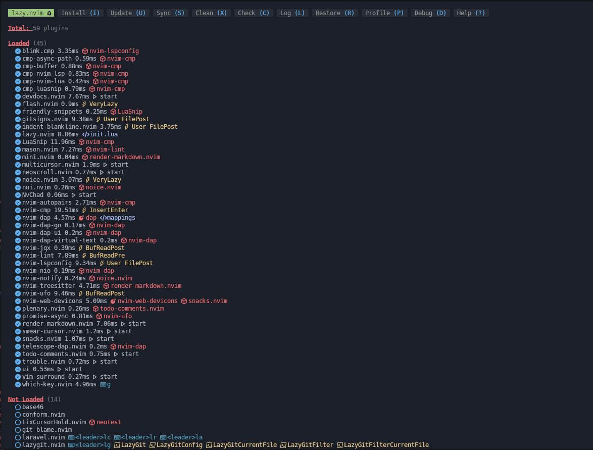

## neovim config

**Plugin**



**Neovim Version**
 
```bash
nvim git:(main) ✗ nvim --version

NVIM v0.11.4
Build type: Release
LuaJIT 2.1.1741730670
Run "nvim -V1 -v" for more info
➜  nvim git:(main) ✗ 

```

**Struktur File**

```bash
➜  nvim git:(main) ✗ tree              
.
├── image
│   └── plugin-nvim.png
├── init.lua
├── lazy-lock.json
├── lua
│   ├── autocmds.lua
│   ├── chadrc.lua
│   ├── configs
│   │   ├── cmp.lua
│   │   ├── conform.lua
│   │   ├── dap.lua
│   │   ├── lazy.lua
│   │   ├── lint.lua
│   │   ├── lspconfig.lua
│   │   ├── nvim-tree.lua
│   │   ├── nvim-treesitter.lua
│   │   ├── snacks.lua
│   │   ├── todo.lua
│   │   ├── triforce-module.lua
│   │   └── trouble.lua
│   ├── mappings.lua
│   ├── options.lua
│   └── plugins
│       ├── colorizer.lua
│       ├── conform.lua
│       ├── devdocs.lua
│       ├── flash.lua
│       ├── git-blame.lua
│       ├── init.lua
│       ├── jqx.lua
│       ├── laravel.lua
│       ├── lazygit.lua
│       ├── menu.lua
│       ├── multicursor.lua
│       ├── neoscroll.lua
│       ├── neotest.lua
│       ├── noice.lua
│       ├── nvim-cmp.lua
│       ├── nvim-dap.lua
│       ├── nvim-dap-python.lua
│       ├── nvim-lint.lua
│       ├── nvim-lspconfig.lua
│       ├── nvim-tree.lua
│       ├── nvim-treesitter.lua
│       ├── nvim-ufo.lua
│       ├── render-markdown.lua
│       ├── smear-cursor.lua
│       ├── snacks.lua
│       ├── todo-comments.lua
│       ├── trouble.lua
│       ├── vim-surround.lua
│       └── volt.lua
└── README.md

4 directories, 49 files

```

**Checkhealth**

```bash
<cmd>Checkhealth<CR>

```

---
